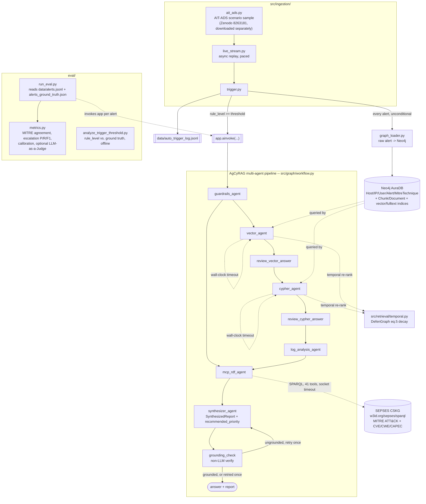

# AgCyRAG Prototype: Security Alert & Decision-Support System

Status doc for the prototype built on top of the original AgCyRAG repo (see
`README.md` for the original system). Companion to
`../defengraph_vs_agcyrag_analysis.md`, which this prototype directly acts
on (section references below point back to it). Plan file this was built
from: `misty-soaring-goose` (4-phase roadmap + Phase 0 prerequisite fix).

Last updated: 2026-08-17 (data pipeline consolidated onto AIT-ADS; retrieval
timeout fix; LLM-as-a-Judge scoring added).

---

## 1. What this prototype adds

The original AgCyRAG is a **manually-queried** multi-agent RAG system: an
analyst types a question, `src/run.py` invokes the LangGraph pipeline once,
and it queries a Neo4j graph that's assumed to already exist (built by an
external, no-code hosted tool -- nothing in the original repo builds it).

This prototype adds everything needed to turn that into an **automatic,
evaluated decision-support system**, and it is now fully running end-to-end
against real infrastructure (Neo4j AuraDB, OpenAI, the live SEPSES CSKG):

| # | Addition | Fixes / addresses |
|---|---|---|
| 0 | Lazy Neo4j/LLM init | `settings.py` crashed at import with no credentials at all (analysis §3.2.6) |
| 1 | Graph-construction + live stream + auto-trigger | No graph-construction code existed anywhere (analysis §3.2.5); trigger was manual-only (comparison table) |
| 2 | Structured synthesizer output + grounding check | Synthesizer was free-text with no way to verify citations (analysis §3.1.4, §5.4) |
| 3 | Temporal decay weighting on retrieval | AgCyRAG retrieval had no notion of recency at all |
| 4 | Ground-truth-based quantitative eval (no reference answers) | AgCyRAG had zero quantitative evaluation (analysis §3.5.15); scores against the dataset's own structured labels instead of narrative similarity, so no human-authored reference answer is needed |
| 5 | MCP RDF / CSKG live, bounded, and timeout-safe | `mcp-cskg-rdf` had no working config, an SSL trust gap, no result-size bounds, no ID-based technique lookup, and no timeout on its SPARQL calls (caused multi-minute hangs) |
| 6 | Wall-clock timeout on retrieval retry loops | `cypher_agent`/`vector_agent` retry only bounded *how many* attempts happen, not how long any single attempt could take -- same failure class as #5, just not yet observed there |
| 7 | LLM-as-a-Judge scoring (optional) | Structural ground-truth metrics (technique/escalation match) don't capture answer quality, faithfulness, or clarity -- added the validated rubric from Hamzić et al. 2604.11419v1 as a complementary scoring pass |

---

## 2. Architecture

### 2.1 Original AgCyRAG (unchanged logic, only touched for wiring)

| File | Role |
|---|---|
| `src/agents/guardrails_agent.py` | Relevance check + routes to `log_analysis` or `cyber_knowledge` |
| `src/agents/vector_agent.py` | Full-text entity search + vector similarity search (Neo4j) |
| `src/agents/cypher_agent.py` | LLM-generated Cypher against the Neo4j schema |
| `src/agents/reflection_agent.py` | Rephrases the question on insufficient vector/cypher results |
| `src/agents/review_agent.py` | Judges sufficient/insufficient |
| `src/agents/log_analysis_agent.py` | Summarizes log findings, decides if CSKG lookup is needed |
| `src/agents/mcp_rdf_agent.py` | Queries the MITRE ATT&CK/CVE RDF graph via MCP |
| `src/graph/workflow.py` | LangGraph wiring of all of the above |
| `src/run.py` | CLI: one manually-typed question -> one pipeline run |

### 2.2 `src/config/settings.py`

Neo4j graph, vector index, and schema fetch are lazy (`_LazyProxy`,
`get_schema_escaped()`) -- connect on first real use instead of at import
time. Reads `NEO4J_AURA_DATABASE` (previously silently ignored -- this was
the actual cause of an early `DatabaseNotFound` error, not a provisioning
delay). `llm` always constructs successfully (placeholder API key when
unset). `_LazyProxy.resolve()` returns the real underlying object for
call-sites needing actual `isinstance` conformance --
`GraphCypherQAChain.from_llm(graph=...)` is pydantic-validated against
`GraphStore` and silently rejected the proxy at first real use (caught via a
live run, not by earlier offline testing, since offline testing never
exercised a Cypher call end-to-end).

### 2.3 `src/ingestion/`

| File | Role |
|---|---|
| `schema.py` | `Alert` Pydantic model (Wazuh-style fields, real MITRE IDs) |
| `ait_ads.py` | Loads a sample from the [AIT Alert Data Set](https://zenodo.org/records/8263181) (real Wazuh/Suricata/AMiner alerts) -- writes `data/alerts.jsonl` + `data/alerts_ground_truth.json`. Ground truth is derived from labeled attack-phase time windows (`labels.csv`), not a per-alert field |
| `graph_loader.py` | `ingest_alert()` / `load_all()` -- writes the structured entity graph **and** the Chunk/Document layer `vector_agent.py` expects (fulltext `entities` index, `vector`+`keyword` hybrid index) |
| `live_stream.py` | `stream_alerts()` -- async generator replaying `alerts.jsonl` in timestamp order |
| `trigger.py` | `handle_alert()` -- ingests every alert; auto-invokes `app.ainvoke(...)` only when `rule_level >= TRIGGER_SEVERITY_THRESHOLD` (default `7`). Logs to `data/auto_trigger_log.jsonl` |
| `run_live.py` | CLI entrypoint wiring the two above |

### 2.4 Structured output + grounding

- `src/agents/synthesizer_agent.py`: `SynthesizedReport` (8 report fields + `cited_entities`, `mitre_techniques`, `confidence`, `recommended_priority` [ignore/monitor/escalate]) via `llm.with_structured_output(...)`.
- `src/agents/grounding_check.py`: regex-based, non-LLM check that every cited entity/MITRE ID/IP appears in retrieved context.
- `src/graph/workflow.py`: `grounding_check` node after `synthesizer`, one bounded retry on failure.

### 2.5 `src/retrieval/temporal.py`

`temporal_weight(node_ts, query_ts, alpha_per_hour=0.05)` = DefenGraph eq. 5,
ported from `../defengraph_recreation/src/llm_stages.py`. Re-ranks
`cypher_agent.py` / `vector_agent.py` results by recency. Missing timestamp
= weight 1.0, matching DefenGraph's immutable-SKG-entity convention.

### 2.6 `mcp-cskg-rdf/` (MITRE ATT&CK + CVE server)

Live and working against the public SEPSES CSKG (`https://w3id.org/sepses/sparql`),
per the original AgCyRAG paper's own methodology (§4.1) -- no local `.ttl`
file needed. Fixes made over the course of this prototype:

1. **`browser_mcp.json`** created at the repo root, pointing at the actually-bundled
   server (README previously documented a different external repo with a wrong flag).
2. **`truststore` injection** in `server.py` -- the endpoint's TLS cert chain
   (a recent Let's Encrypt intermediate) isn't trusted by every installed
   `certifi` snapshot, even though it's valid (curl/macOS accept it fine).
   Confirmed not a systemic issue (a plain `google.com` request worked)
   before diagnosing and fixing.
3. **Result-size bounds** in `format_sparql_results()` -- previously
   unbounded; a single broad keyword call could return 50 rows with full
   multi-paragraph descriptions each, bloating context and latency. Now
   capped (400 chars/description, ~6000 chars total). Discovered live, not
   theoretically -- watched a real run stall on exactly this.
4. **`get_technique_by_id` tool added** -- none of the original 40 tools
   could look up a technique by its ATT&CK ID (e.g. "T1505.003"), only by
   name/label text. Fixed by following the existing `get_cve_by_id` pattern;
   verified the agent picks it correctly on the first try post-fix.
5. **`get_techniques_by_platform` SPARQL type error fixed** -- `?platform`
   is a URI resource, not a literal; `LCASE()` needs `STR()` wrapping first.
6. **`get_mitigations_for_technique` duplicate-row explosion fixed** -- the
   underlying CSKG has duplicate triples and parallel canonical/slug URIs
   for the same entity; `SELECT DISTINCT` over label columns only (dropping
   URI columns) collapsed ~76 near-identical rows for "Valid Accounts" down
   to the 12 genuine distinct mitigations.
7. **Socket-level timeout** (`socket.setdefaulttimeout(30)`) -- `rdflib`'s
   `SPARQLConnector.query()` calls `urlopen()` with no timeout on any code
   path (confirmed directly in its source), and passing `timeout=` to
   `SPARQLStore()`'s constructor doesn't help either since it's never
   extracted from `self.kwargs`. This caused two real hangs (37 min and 11
   min, confirmed via `ps aux` CPU-time deltas showing near-zero CPU over
   long wall-clock time) before being root-caused and fixed. Verified live:
   a normal query still succeeds (~3s); a deliberately-unreachable host
   correctly raises after the timeout instead of hanging.

### 2.7 Retrieval timeout (`src/graph/workflow.py`)

The MCP hang above (§2.6.7) is one instance of a broader gap: `max_iterations`
(default 3) bounds how many times `cypher_agent`/`vector_agent` retry, but
nothing bounded how long any *single* attempt could take. A slow or stuck
LLM call or Neo4j query could stall the whole pipeline indefinitely --
exactly the failure class Hamzić et al. (2604.11419v1) document as GraphRAG's
worst-case behavior (Case 3: a 2,348s/39-minute hang on an unanswerable
query, iteratively retrying invalid Cypher property names instead of ever
concluding "not found").

Fixed by running every `cypher_agent`/`vector_agent`/`mcp_rdf_agent` call in
a worker thread (`asyncio.wait_for` for the async MCP node) with a hard
wall-clock deadline (`NODE_CALL_TIMEOUT_SECONDS`, default 60s, env-overridable).
A timeout is treated as an ordinary retrieval failure -- the existing
except blocks already degrade gracefully to "no context found" and let
reflection/`max_iterations` take over, so this needed no new error-handling
path, just a bound on how long any one attempt can occupy before that
existing path kicks in. Verified with a synthetic fast/slow-function test:
a 2s function call under a 1s timeout raises cleanly instead of blocking.

### 2.8 LLM-as-a-Judge scoring (`eval/metrics.py::score_llm_judge`)

Structural ground-truth metrics (MITRE technique match, escalation match)
only check whether specific facts line up -- they say nothing about whether
the prose answer is well-formed, faithful to the retrieved evidence, or
hallucinates unrelated detail. Added the validated 4-criterion weighted
rubric from Hamzić et al. 2604.11419v1 Sec.3.11: Agreement (weight 4),
Adequacy (weight 3), Faithfulness (weight 2), Clarity (weight 1), each
scored 0-5 by an LLM judge, weighted total out of 50. Their own post-hoc
validation (N=2,640 judgments) found Agreement/Adequacy/Faithfulness form a
tightly coupled correctness cluster (r=0.91-0.98) while Clarity stays
substantially less correlated (r=0.43-0.50) -- confirming it captures a
genuinely orthogonal quality dimension (a fluent-but-wrong answer scores
high on Clarity, low on the rest) rather than just restating the others.

Since this dataset has no human-authored narrative reference answer,
`eval/run_eval.py::build_baseline_answer()` synthesizes the minimal factual
statement the structural ground truth actually supports (attack-phase
membership + MITRE technique, if any) for the judge to compare against --
not a full analyst writeup, just the facts a correct answer must not
contradict. One extra LLM call per scored alert, so it's opt-in
(`--llm-judge` flag / `run_eval.sh --llm-judge`) rather than always-on.

### 2.9 `eval/`

| File | Role |
|---|---|
| `run_eval.py` | Reads `data/alerts.jsonl` + `data/alerts_ground_truth.json` locally (no API calls to load). By default runs *every* sampled alert through `app.ainvoke` regardless of level, measuring the LLM's own judgment quality against ground truth (`mitre_technique`/`should_escalate`/`confidence`). `--llm-judge` also runs `score_llm_judge` per alert. `--gate-filter` instead only runs alerts passing `TRIGGER_SEVERITY_THRESHOLD` (matching real production behavior) and reports **end-to-end** precision/recall (gate + LLM combined, decomposed into gate recall × LLM-conditional recall) against all true attack-phase alerts in the sample, not just the ones that reached the LLM |
| `metrics.py` | Four metric classes, each mapping onto an established evaluation approach rather than something invented for this project: MITRE technique agreement (TRAM/TTPrint/TTPXHunter-style precision/recall/F1), escalation confusion matrix (SOC alert-triage-LLM-benchmark-style), calibration-by-confidence bucketing (OpenSec-style), and LLM-as-a-Judge (§2.8) |
| `analyze_trigger_threshold.py` | Offline (no LLM/DB calls): sweeps `TRIGGER_SEVERITY_THRESHOLD` against `rule_level` vs. ground-truth `should_escalate` in the current local sample -- see §3.3 finding below |

---

## 3. Findings

### 3.1 Confidence calibration fix

Confidence was found to be "high" on all 25 predictions in an early
evaluation run, including every wrong escalation -- confidently wrong, not
hedged, and uninformative for the calibration check. Root cause: the field
was purely LLM self-assessed with no structural constraint. Fix in
`src/graph/workflow.py`: `_context_richness()` deterministically counts how
many of the 3 possible evidence sources (Cypher/vector/CSKG) returned
substantive (non-placeholder, non-error) content, and `_cap_confidence()`
caps the LLM's stated confidence at what that count can support (0 sources
-> at most "low", 1 -> at most "medium", 2-3 -> "high" allowed). Only ever
lowers confidence, never raises it. Unit-verified directly (0/1/3 sources ->
low/medium/high cap) and confirmed capping live on a genuinely low-evidence
alert (capped to "medium" instead of defaulting to "high").

This is independently validated by Hamzić et al. 2604.11419v1's concept of
*structural hallucination* (Table 25): a fluent answer that's formally
consistent with retrieved data but unsupported because the schema/graph
didn't actually cover the question -- exactly the failure mode this fix
targets, arrived at independently before that paper was read.

### 3.2 Trigger threshold is not discriminative on real AIT-ADS severity data

**First pass** (87-alert sample): `eval/analyze_trigger_threshold.py` found
every single sampled alert was `rule_level=3`, with `TRIGGER_SEVERITY_THRESHOLD=7`
catching zero of 50 genuine attack-phase alerts. This turned out to be a
real bug, not a property of the dataset: `src/ingestion/ait_ads.py`'s
`to_alert()` derived host identity only from `predecoder.hostname` or
`data.dest_ip` -- but almost every high-severity alert in AIT-ADS (across
all 8 scenarios, confirmed by downloading and checking the full Zenodo
archive) is a Suricata/snort-decoded network alert that has neither field.
`agent.ip` (the actual internal host that generated the alert) is present
on 100% (778/778 checked) of those previously-unrepresentable level>=7
alerts and is now used as a fallback -- fixed in `to_alert()`.

**Second pass** (178-alert sample, post-fix): real severity variety is now
visible (levels 3/5/6/8/10/11 present). `analyze_trigger_threshold.py` was
extended to report F1 and F2 (recall-weighted 4x, a rough proxy for
security alerting's usual cost asymmetry -- a missed attack is normally far
more expensive than an analyst dismissing a false alarm) per threshold, and
to flag Pareto-dominated thresholds automatically. Findings on this sample:
`rule_level=6` is strictly dominated (worse precision *and* recall than
`rule_level=5` simultaneously -- an artifact of a batch of generic "IDS
event." alerts sitting at exactly that level) and should never be chosen.
Both F1 and F2 pick `rule_level>=3` (essentially no severity filtering) as
best among pure-severity cutoffs, since severity alone loses recall faster
than it gains precision at every other candidate threshold. `rule_level>=7`
(the production default) recall was 0.039 on this sample.

**Fix landed**: `src/ingestion/trigger.py`'s gate is now `rule_level >=
TRIGGER_SEVERITY_THRESHOLD OR alert.rule_mitre_id` (native MITRE ATT&CK tag
present) rather than severity alone -- verified to raise recall to 0.180
(4.6x) at the same threshold=7 default, with 38 of 43 triggered alerts
reaching the pipeline via the MITRE-tag path specifically, not severity.
Still open: `rule_level>=5 OR has_mitre_tag` scored meaningfully better yet
in testing (F1 0.747 vs the deployed combo's 0.269) -- whether to also
lower the default threshold remains an open, not-yet-made call (a policy
question about relative cost of missed attacks vs. false alarms, not a
statistical one). See §5.

---

## 4. What's fully working (live-verified, not just offline)

- Full pipeline runs end-to-end against real Neo4j AuraDB + OpenAI + the live SEPSES CSKG.
- AIT-ADS alert sample ingested and queryable, with genuine cross-alert host correlation (a handful of hosts hit repeatedly, unlike single-alert-per-host data sources tried earlier).
- Cross-alert correlation confirmed in real output (e.g. an alert about outbound traffic correctly surfaced an *earlier* alert's SSH login and discovery activity from the same incident -- not just the triggering alert's own text).
- Grounding check passes/fails correctly on live runs, not just unit tests.
- Temporal re-ranking, structured synthesizer output, and the full MCP/CSKG path all verified together in the same live run.
- Confidence calibration cap verified both in isolation and live.
- MCP SPARQL timeout and retrieval-loop timeout both verified live (normal calls unaffected; simulated hangs correctly time out instead of blocking).

## 5. What still needs to be done

1. **Run a full clean eval** now that the retrieval-timeout fix and LLM-as-a-Judge scoring are both in place -- the last two attempts were interrupted mid-run (once by a since-fixed MCP hang, once manually) before either fix landed.
2. **Decide whether/how to act on the escalation precision finding** -- tune the triage prompt, or treat high-recall/low-precision as the intentionally-correct security posture (never miss a real threat) and report it as-is. (An early over-escalation pattern was observed live: alerts get flagged as escalate-worthy based on surface language -- "Authentication", mail-server context -- rather than actual severity signal, even on plain, level-3, non-attack-phase events like routine Dovecot logins.)
3. ~~**Trigger threshold needs a real fix**~~ **Partially done**: `trigger.py`'s gate is now `rule_level >= TRIGGER_SEVERITY_THRESHOLD OR alert.rule_mitre_id` (native MITRE ATT&CK tag present), not severity alone. Verified on the current sample: recall rose from 0.039 (severity-only) to 0.180 (4.6x) with `TRIGGER_SEVERITY_THRESHOLD` left at its default of 7 -- 38 of 43 triggered alerts now get through via the MITRE-tag path, not severity. Still open: `eval/analyze_trigger_threshold.py`'s Pareto/F-beta analysis found `rule_level>=5 OR has_mitre_tag` scores meaningfully better still (F1 0.747 vs 0.269 for the tag-plus-level-7 combo actually deployed) -- whether to also lower the default threshold is a separate, not-yet-made decision (see §3.2's F1 vs F2 discussion: it depends on how costly a missed attack is judged to be relative to analyst review time, a policy call, not a statistical one). A lightweight frequency/correlation pre-filter beyond these two signals remains unexplored.
4. **SPARQL-side `LIMIT` clauses** on the handful of MCP tools still missing one (defense-in-depth beyond the output-bounding fix in §2.6.3, lower urgency now that the actual observed problem is fixed).
5. Analysis doc's other proposals (§5.1 three-layer KG, §5.6 adversarial-robustness eval, §5.7 SOAR baseline) remain out of scope for this prototype.

## 6. Known limitations / deviations (for the thesis writeup)

- **Single-scenario sample.** Only `russellmitchell` (one of AIT-ADS's 8 scenarios) has been downloaded and evaluated so far; findings like §3.2's flat-severity pattern are confirmed for this scenario specifically, not yet cross-checked against the other 7.
- **`alpha_per_hour=0.05`** in temporal decay is a free parameter, same as DefenGraph's own paper -- not tuned against ground truth.
- **Grounding check is regex/substring-based, not semantic.** Only catches claims using recognizable entity syntax; a hallucination phrased without those patterns won't be caught (analysis §5.4's stated non-LLM tradeoff).
- **MITRE agreement metric is recall-only against a single labeled technique per alert.** A bot correctly citing additional, genuinely-relevant techniques the dataset didn't label would be penalized on precision if that were computed -- a known limitation of single-label ground truth, not of the bot. It's also only computed over the ~36% of alerts that carry a native MITRE tag at all.
- **Escalation ground truth is derived purely from attack-phase timestamp windows.** It may depend on signals the bot isn't given (e.g. base-rate context, whether an IP/host is already known-bad) -- observed false-positive patterns may partly reflect this rather than pure reasoning failure; not disentangled in this prototype.
- **Retrieval timeout (§2.7) is a coarse wall-clock bound (default 60s), not a smarter retry/backoff strategy.** A legitimately slow-but-eventually-successful call past the deadline is treated the same as a genuinely stuck one.
